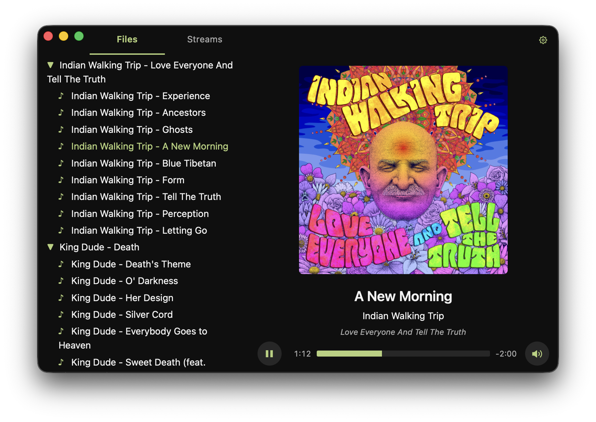

# Pudding



Vibe coded media player.

I made this for myself but you're welcome to use it.

## Philosophy

Local file playback and internet radio. High polish, no bloat.

## Install

No prebuilt releases - build it yourself. Requires [Rust](https://www.rust-lang.org/tools/install), [Node](https://nodejs.org/), and [pnpm](https://pnpm.io/).

```sh
pnpm install
pnpm tauri build
```

On macOS the dmg auto-opens. Drag Pudding into Applications and you're good to go.

## Keyboard shortcuts

- `Space` - play / pause
- `↑` / `↓` - volume up / down (10%)
- `←` / `→` - seek back / forward 10s (files only)

## Tech stack

- [Tauri](https://tauri.app/) 2 - desktop shell
- Rust backend with [rusqlite](https://github.com/rusqlite/rusqlite) for the metadata cache, [lofty](https://github.com/Serial-ATA/lofty-rs) for tag reading, and [notify](https://github.com/notify-rs/notify) for live library watching
- TypeScript frontend built with [Vite](https://vitejs.dev/) - no UI framework, reactivity via [Preact signals](https://github.com/preactjs/signals)
- Custom Web Audio engine for gapless playback, with an `<audio>` fallback for streams and unsupported codecs

## Manifest format

Defines the stream list. Configured in settings.

```json
[
  { "name": "SomaFM Groove Salad", "url": "https://ice5.somafm.com/groovesalad-128-mp3" },
  { "name": "NightRide FM", "url": "https://stream.nightride.fm/nightride.mp3" }
]
```
