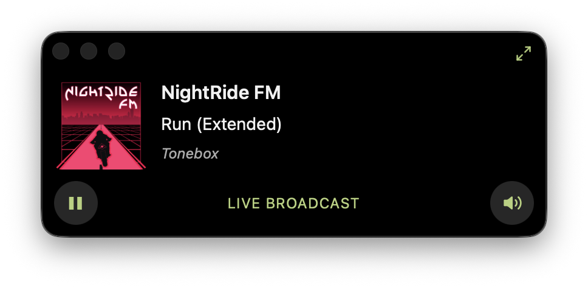

# Pudding




Filesystem-first desktop media player in the spirit of Winamp but with the modern niceties of Spotify / Apple Music.

## Philosophy

* Files and radio only.
* High polish, high completeness.
* Compact 2 column layout.

## Features

### Local playback

- Custom Rust audio engine (symphonia + cpal) with gapless playback: tracks are joined sample-to-sample in a single continuous output stream
- Plays MP3, FLAC, WAV, AAC/M4A, Ogg/Opus, and AIFF
- High-quality sinc resampling to match your output device
- Shuffle and repeat (off / all / one), applied live without interrupting the current track
- Autoadvance toggles in the Playback menu, set separately for the file browser and for playlists/queues — turn it off and playback stops at the end of each track instead of rolling on

### Library

- Point it at one or more folders: no import step, your files browsed as they are
- Four lenses on the same library, switched from the Files pane: Browse the real folder tree, or view it flat as Songs, Artists, or Albums — the last three drill iPod-style (artist → album → tracks) and remember your place across restarts
- Fast SQLite metadata cache, scanned in the background
- Built to scale: snappy at 100,000 tracks and functional to 500,000 — every long list (Songs, folder tree, queue, playlists) is windowed so only the on-screen rows exist in the DOM, opened lens views are cached, and the whole-library sort is served from a covering index
- Live library watching: add or edit files on disk and the app updates itself
- Search across title, artist, album, and filename — or match a folder and play it as an album
- Search results show rather than play: artist, album, folder, and playlist hits open their view, and a track hit reveals itself in the folder tree — right-click any track hit to Play it or add it to a playlist
- Embedded album art, and disc/track-number-aware sorting
- Registered for audio file types: double-click a file in Finder and it plays here (single instance)

### Playback queue

- Create and manage queues using context menus and drag-and-drop.

### Playlists

- Playlists are plain `.m3u8` files on disk — no database lock-in, hand-editable and readable by any other player, and they autosave on every change
- Start one from the Playlist menu (New Playlist…), or turn the current queue into a saved playlist with Save Queue as Playlist… (⌘S)
- Right-click any track and use "Add to playlist ▸" to file it into an existing list or a new one
- Single-click a playlist in the tree to browse it, double-click to play; rename, move, or delete it from the tree or the Playlist menu
- Recent playlists live under Playlist ▸ Open Recent, and every `.m3u` / `.m3u8` under your library is searchable

### Internet radio

- Icecast / SHOUTcast streams with in-band ICY now-playing metadata
- Manage your stations right in the Streams tab — add, edit, reorder, and delete, with optional per-station art — saved to a plain `.m3u8` you can also hand-edit or share
- Starts with a writable list on first run; point it at any existing `.m3u` / `.m3u8`, or a remote `http(s)` URL (read-only)
- Automatic reconnect with backoff; pausing disconnects, resuming rejoins the live edge
- `.pls` / `.m3u` playlist URLs resolve automatically

### Interface

- Light and dark themes, each with a variety of flavors
- Compact mini player mode (double click now playing)
- Window size and position remembered separately for mini and normal modes
- Keyboard shortcuts for playback, volume, and seeking (see below)
- macOS system integration: Now Playing in Control Center and the lock screen (with album art), plus hardware media keys for play/pause and next/previous

## Install

No prebuilt releases - build it yourself. Requires [Rust](https://www.rust-lang.org/tools/install), [Node](https://nodejs.org/), and [pnpm](https://pnpm.io/).

```sh
pnpm install
pnpm tauri build
```

On macOS the dmg auto-opens. Drag Pudding into Applications and you're good to go.

## Keyboard shortcuts

- `Space` - play / pause
- `↑` / `↓` - volume up / down (10%)
- `←` / `→` - seek back / forward 10s (files only)
- `⌘F` / `Ctrl+F` - focus search
- `⌘S` - save the current queue as a playlist

## Tips

A few things that aren't obvious:

- **Click the title in Now Playing** to jump to wherever the current track is playing from.
- **Click the Files tab while it's already showing** to pop back to the top of the navigation hierarchy.
- **Double-click the album art** to switch between the full window and the compact mini player.

## Tech stack

- [Tauri](https://tauri.app/) 2 - desktop shell
- Rust backend with [rusqlite](https://github.com/rusqlite/rusqlite) for the metadata cache, [lofty](https://github.com/Serial-ATA/lofty-rs) for tag reading, and [notify](https://github.com/notify-rs/notify) for live library watching
- TypeScript frontend built with [Vite](https://vitejs.dev/) - no UI framework, reactivity via [Preact signals](https://github.com/preactjs/signals)
- Native Rust audio engine ([symphonia](https://github.com/pdeljanov/Symphonia) + [cpal](https://github.com/RustAudio/cpal)) for gapless file playback and internet radio with in-band ICY now-playing metadata

## Some streams I like

This project is not affiliated with these, but I listened to them a lot while working on it.

- **[SomaFM](https://somafm.com/listen/)** ambient, downtempo, etc.
- **[Nightride FM](https://nightride.fm)** synthwave, etc.

Both run on listener support, so consider throwing them a few bucks.