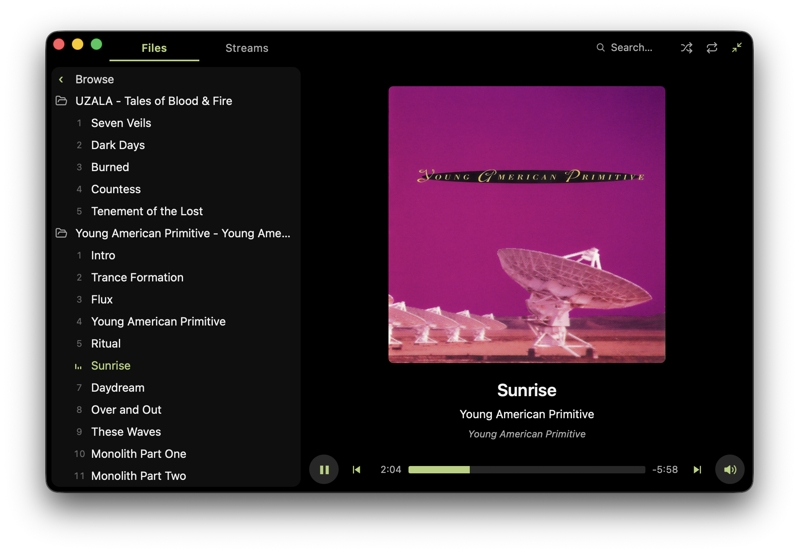

# Pudding



Desktop media player. I made this for myself but you're welcome to use it.

## Philosophy

Local file playback and internet radio. High polish, high completeness, fast, no bloat.

## Features

### Local playback

- Custom Rust audio engine (symphonia + cpal) with gapless playback: tracks are joined sample-to-sample in a single continuous output stream
- Plays MP3, FLAC, WAV, AAC/M4A, Ogg/Opus, and AIFF
- High-quality sinc resampling to match your output device
- Shuffle and repeat (off / all / one), applied live without interrupting the current track

### Library

- Point it at a folder: no import step, your files browsed as they are
- Fast SQLite metadata cache, scanned in the background
- Live library watching: add or edit files on disk and the app updates itself
- Search across title, artist, album, and filename
- Embedded album art, and disc/track-number-aware sorting
- Registered for audio file types: double-click a file in Finder and it plays here (single instance)

### Internet radio

- Icecast / SHOUTcast streams with in-band ICY now-playing metadata
- Customizable station list via a simple JSON manifest — or point it at any `.m3u` you already have
- Automatic reconnect with backoff; pausing disconnects, resuming rejoins the live edge
- `.pls` / `.m3u` playlist URLs resolve automatically

### Interface

- Compact mini player mode (double click now playing)
- Window size and position remembered separately for mini and normal modes
- Keyboard shortcuts for playback, volume, and seeking (see below)

## Install

No prebuilt releases - build it yourself. Requires [Rust](https://www.rust-lang.org/tools/install), [Node](https://nodejs.org/), and [pnpm](https://pnpm.io/).

```sh
pnpm install
pnpm tauri build
```

On macOS the dmg auto-opens. Drag Pudding into Applications and you're good to go.

## Keyboard shortcuts

- `Space` - play / pause
- `↑` / `↓` - volume up / down (10%)
- `←` / `→` - seek back / forward 10s (files only)

## Tech stack

- [Tauri](https://tauri.app/) 2 - desktop shell
- Rust backend with [rusqlite](https://github.com/rusqlite/rusqlite) for the metadata cache, [lofty](https://github.com/Serial-ATA/lofty-rs) for tag reading, and [notify](https://github.com/notify-rs/notify) for live library watching
- TypeScript frontend built with [Vite](https://vitejs.dev/) - no UI framework, reactivity via [Preact signals](https://github.com/preactjs/signals)
- Native Rust audio engine ([symphonia](https://github.com/pdeljanov/Symphonia) + [cpal](https://github.com/RustAudio/cpal)) for gapless file playback and internet radio with in-band ICY now-playing metadata

## Manifest format

Defines the stream list. Configured in settings — point it at a local file or a remote `http(s)` URL.

```json
[
  { "name": "SomaFM Groove Salad", "url": "https://ice5.somafm.com/groovesalad-128-mp3" },
  { "name": "NightRide FM", "url": "https://stream.nightride.fm/nightride.mp3" }
]
```

Each entry can optionally include an `image` — shown where album art normally appears while the station plays. It's a URL, either http(s) or `file://`.

```json
[
  {
    "name": "SomaFM Groove Salad",
    "url": "https://ice5.somafm.com/groovesalad-128-mp3",
    "image": "file:///Users/me/radio-art/groove-salad.png"
  }
]
```

Extended M3U works too, so an existing station list from another player can be used as-is. `#EXTINF` titles become station names; entries without one are named after their hostname.

```
#EXTM3U
#EXTINF:-1,SomaFM Groove Salad
https://ice5.somafm.com/groovesalad-128-mp3
#EXTINF:-1,NightRide FM
https://stream.nightride.fm/nightride.mp3
```
