If you hate reading AI-generated documentation, don't worry, I wrote this myself.

## What is Pudding?

Pudding is a macOS music player. It plays local files and can connect to internet radio stations. It is not a streaming service or a store. You bring your own music collection and stream URLs.

It's simple, powerful, and fast even with large collections (tested with up to 500,000 tracks).

## Layout

Pudding is split into two panels. The left panel has two tabs: Files and Streams. The right panel shows Now Playing by default and will show other content depending on what you're doing.

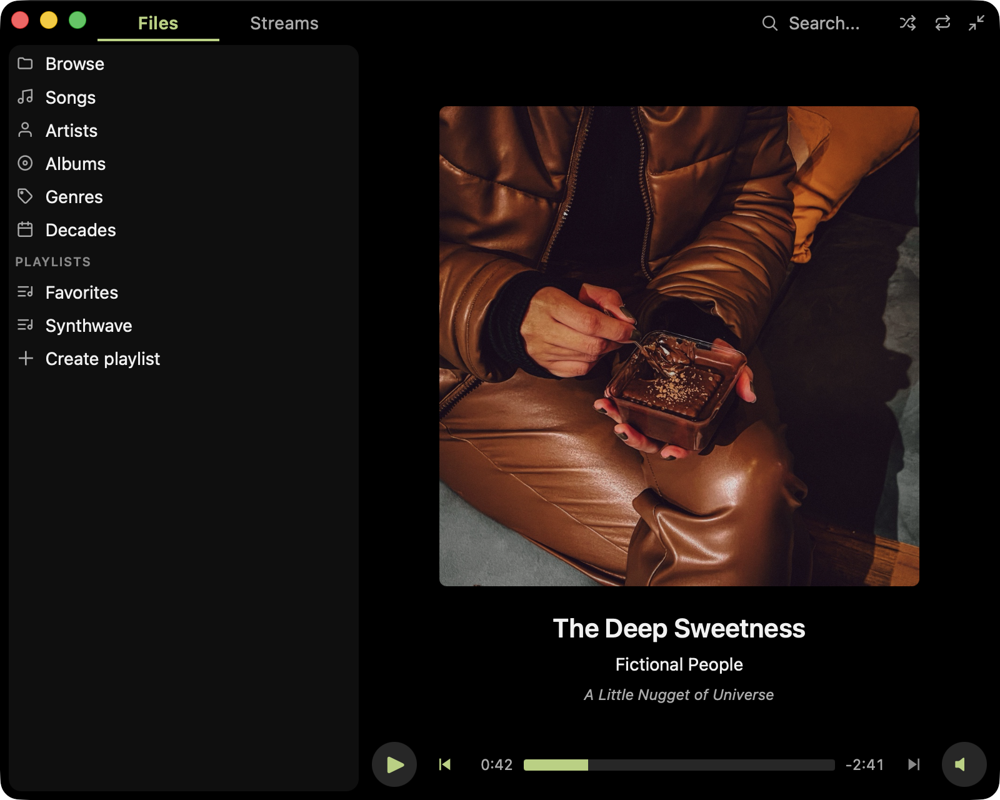

## Files

To show your music collection in the Files panel, go to Pudding > Settings in the main menu and add one or more library folders. When you do this, your music collection is automatically scanned to power Pudding features such as Search. It may be instant, or depending on your hardware and library size, you may see a "Scanning" progress bar at the bottom of the Files panel. While it's scanning you can still use the app, but you might not be able to find files that aren't scanned yet. Your library folders are automatically watched while Pudding is open so external changes are reflected automatically. Pudding also automatically checks for library changes on re-launch.

The Files tab has multiple ways to browse your files:

* Browse: Navigate your library's folder hierarchy as it exists on disk.
* Songs: Shows all your music in one flat list. Useful if you want to shuffle everything.
* Artists: Shows a list of all artists found in your collection's file metadata. You can drill down on albums and individual tracks.
* Albums: Shows a list of all albums found in your collection's file metadata.
* Genres: Shows a list of all genres found in your collection's file metadata.
* Decades: Shows a list of all decades found in your collection's file metadata (uses Release Year).

Below that, the Files panel shows a list of all playlists found in your library folders (you can also find them where they sit in the Browse view).

You can also right click to show sortable column heaaders or additional columns. You can resize the panels to make more space. The defaults are pretty minimal but you have a lot of options.

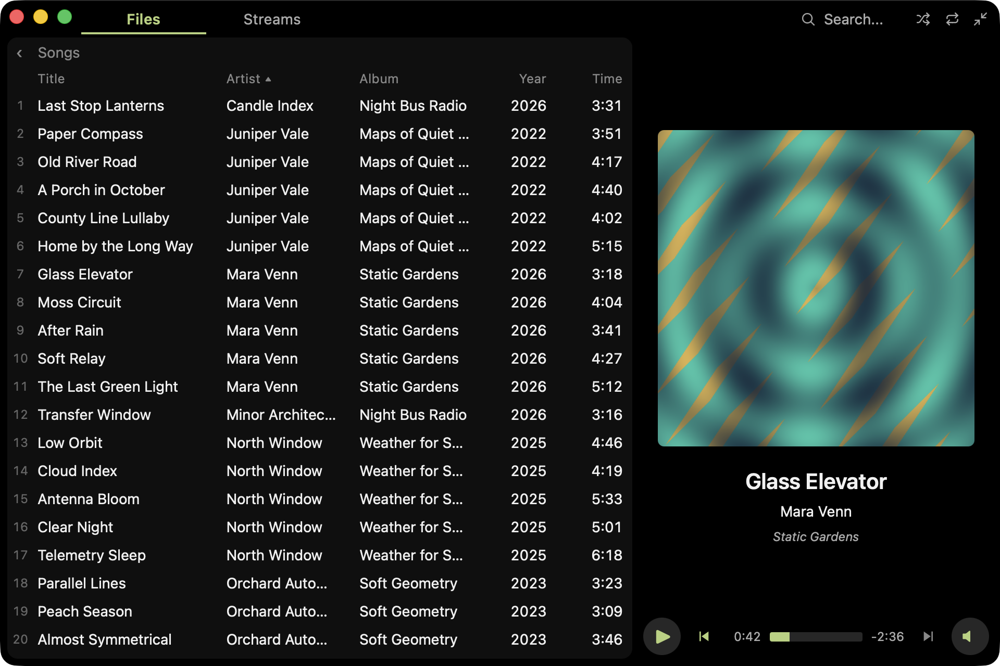

## Search

Search using the search box in the upper right (⌘F is the shortcut to open it). Search can locate files, folders, playlists, artists, albums, and streams.

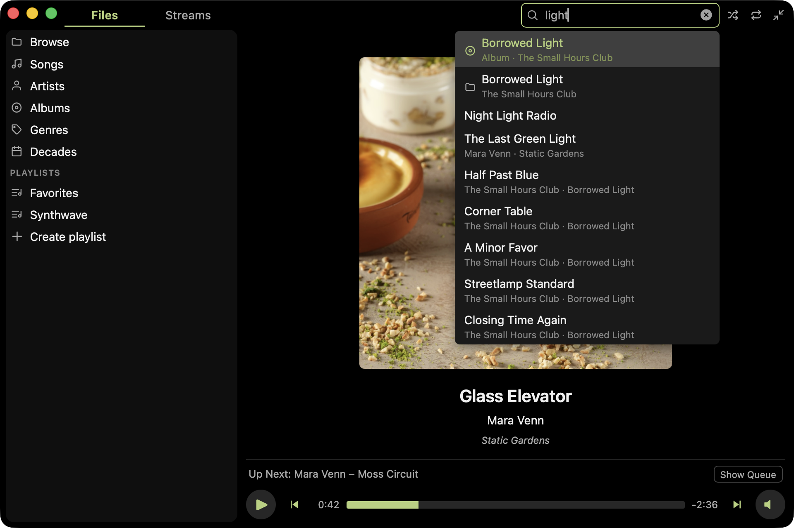

## Streams

The Streams tab shows a list of internet radio stations to play. You can add, edit, reorder, or delete streams right from this list. This list is backed by a playlist file which you can specify in the app settings. You can also use a stream list URL, which of course is read-only.

Some more cool things about streams:

* You can customize the stream artwork.
* The player shows ICY now-playing metadata.
* Pudding automatically reconnects if it loses connection.

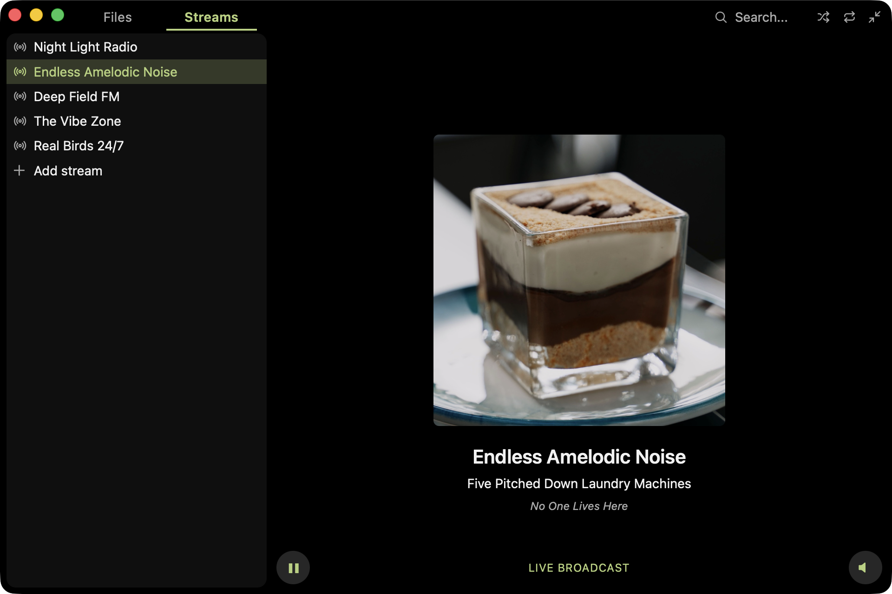

## Now Playing

The default view for the right panel shows art and metadata for the currently playing track. You can click the title to navigate to the context the track is playing from. Likewise, the artist and album are clickable.

## Playlists

Playlists are backed by `.m3u8` files, so if you click "Create playlist" you'll be prompted to create a file. After that, you can edit the playlist any way you want (drag tracks into it, rename, reorder, etc.) and the playlist file is automatically updated.

This feature is important to me because `.m3u8` is a standard format that can be read by other players. If you decide to stop using Pudding in the future you don't even need to do any kind of export to keep your playlists. They are yours from the start.

When you open a playlist it is shown in the right panel, replacing the Now Playing view. While a playlist is being played, you can switch to and from Now Playing using the navigation bar above the player controls.

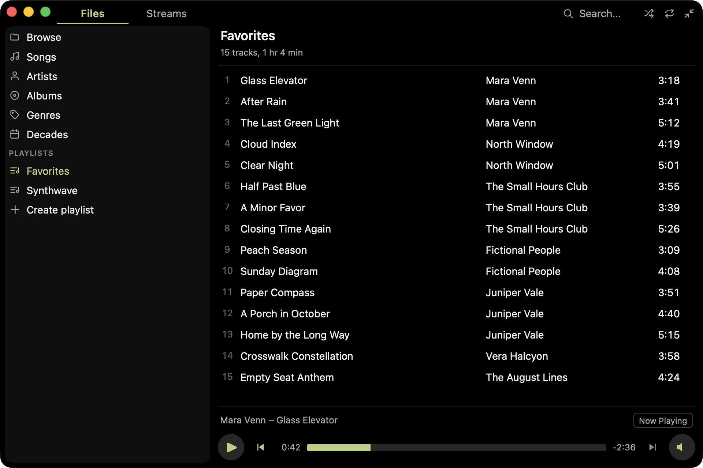

Renaming a playlist's display name edits the `#PLAYLIST` name in the file. You can also select "Move Playlist File..." from the File menu to move and rename the file itself.

You can select multiple tracks to drag into a playlist at the same time. You can also add anything to a playlist (albums, other playlists, etc.) by right clicking on it and selecting "Add to playlist..."

A playlist file can also hold stream URLs, since internet radio stations are handed out as `.m3u` files too. Opening a file that holds a single station just tunes in to it. A station sitting among ordinary tracks is shown in the playlist marked "(Stream)" and has its own play button: it plays on its own rather than as part of the list, because a stream never ends and so has nothing to advance from.

## Queues

A queue is like a playlist that is not backed by a file. When you clear it, it's gone. You can create one by right clicking any file and selecting "Create queue". While a queue exists, the context menu allows you to "Play Next" or "Add to Queue" to put more tracks in the queue.

Queues are shown in the right panel like playlists. In the upper right of the queue view there is a "Clear" button that dismisses the queue. If you'd rather save it, select "Save Queue as Playlist..." from the File menu.

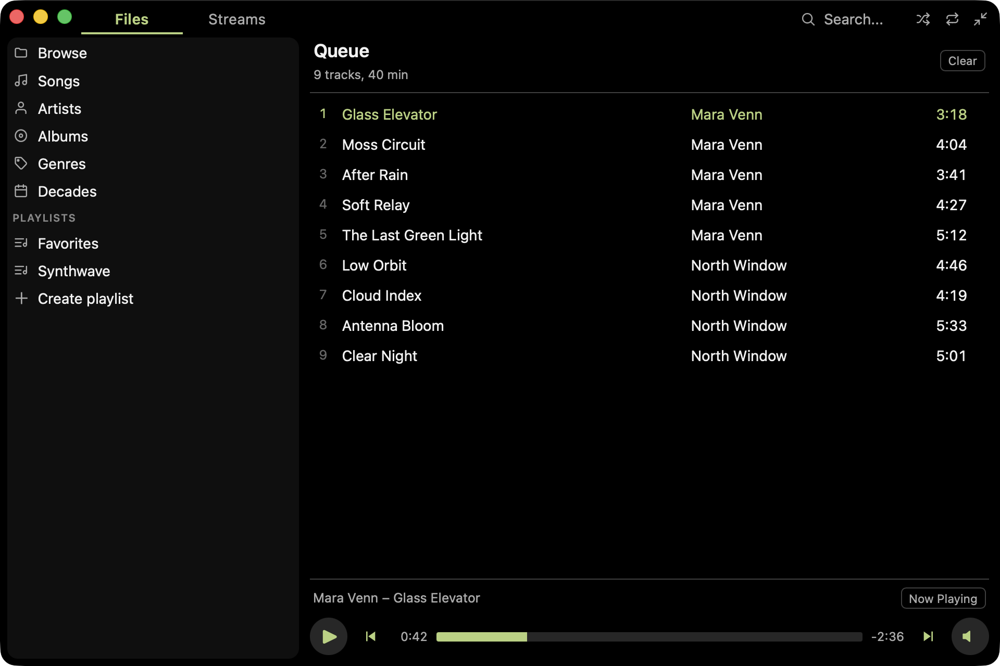

## Autoadvance

This option in the Playback menu controls the behavior when a track ends. With autoadvance disabled, playback will stop. With it enabled, the next track in the _current playing context_ will play. For example, if the track was played from an album in the library, the next track in the album will play. If it was played from a playlist, the next track in the playlist will play, and so on.

Some exceptions:

* With Repeat One enabled, the track repeats even when Autoadvance is disabled.
* With Shuffle enabled, Autoadvance selects another track from the context, not necessarily the next one.

## Mini player

You can activate the mini player a few different ways:

* Window > Mini Player in the menu
* Shift - Command - M
* Double click the now playing album art
* Just resize the player

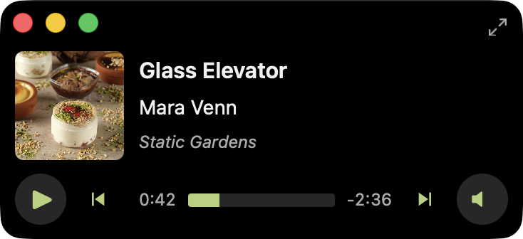

The most recent window size for the normal player and mini player are both saved. For example, if you resize the mini player, then switch to the normal player, the mini player will remember its size the next time you activate it.

## Visualizer

Enable the visualizer from View > Visualizer in the main menu, or hit ⌘T. The visualizer changes Now Playing into an abstract animation fed by the currently playing track's audio signal.

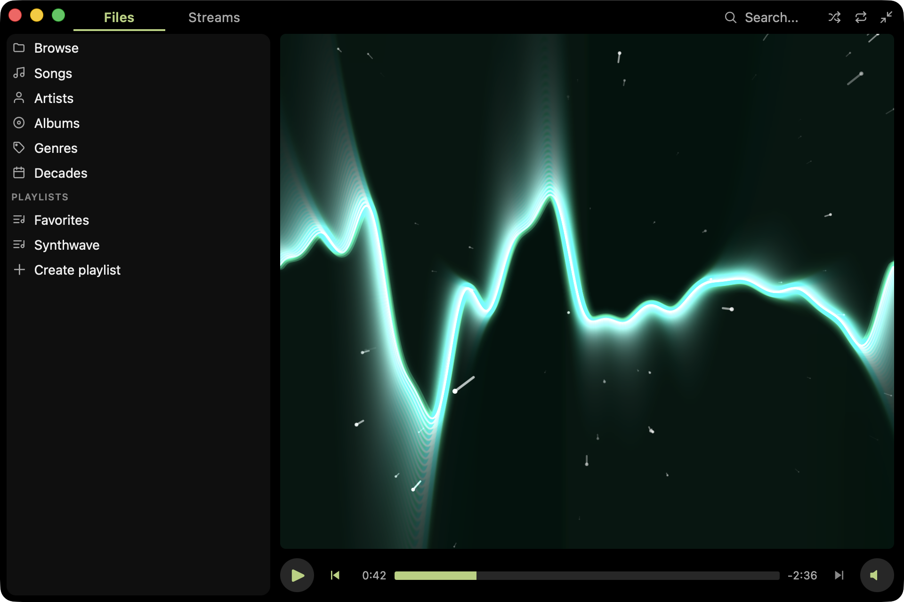

## Zen Mode

Hides everything except Now Playing (or the Visualizer if enabled). Useful in conjunction with Full Screen.

## Themes

Select a theme from Pudding > Settings in the menu. If you check "Match system light / dark mode" then you can actually select two themes. This is useful if your system automatically changes between light and dark mode based on the time of day: you get to choose themes for both times of day.

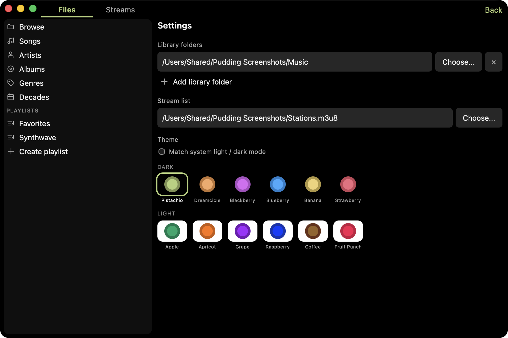

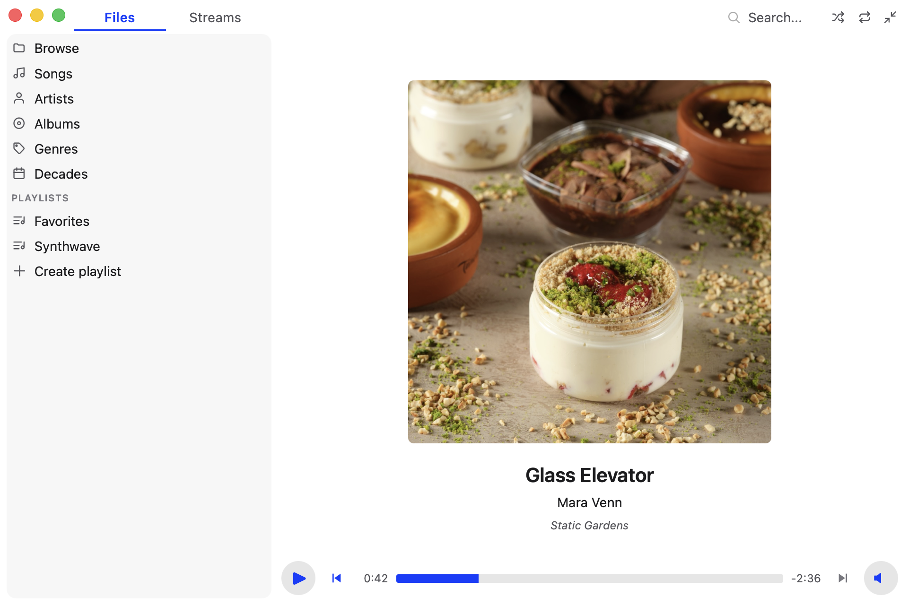

## Equalizer

Reach the equalizer from Playback > Equalizer in the main menu. The appropriate EQ bars light up while a track is playing based on the frequencies of the signal, which may or may not be useful but it is pretty cool in my opinion.

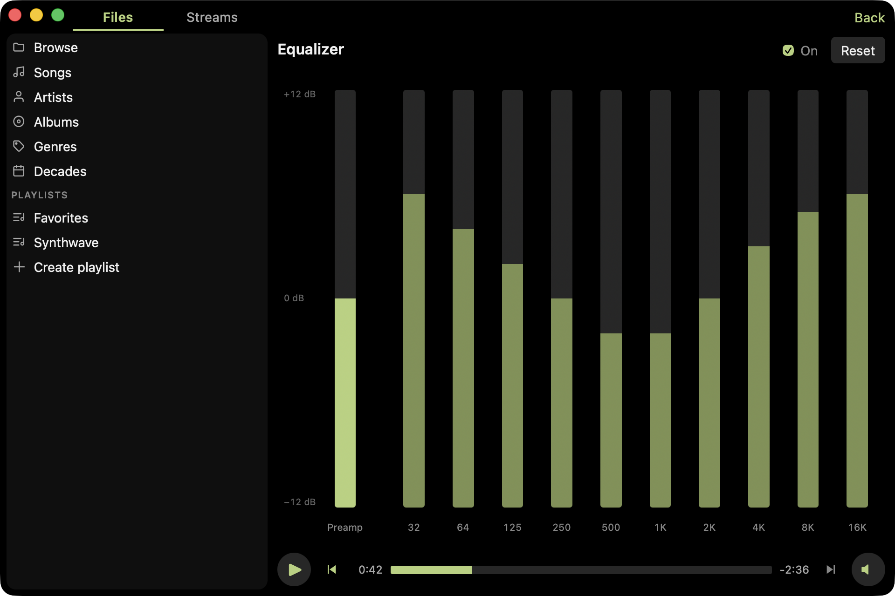

## ReplayGain

ReplayGain is a standard for normalizing the perceived loudness of audio files. Pudding will adjust the volume of audio playback based on the files' ReplayGain metadata while this setting is enabled from the Playback menu.

The options are:

* Off: Ignore ReplayGain metadata.
* Track: Normalize each track independently.
* Album: Normalize using album-level metadata and fall back to track-level metadata.

Pudding does not currently write ReplayGain metadata, as there are other tools you can use to normalize your collection. Do you think Pudding should support ReplayGain scanning? Let me know if you're interested in this feature.

## Match Source Sample Rate

Enable this option from the Playback menu to automatically switch your output device to match each file's sampling rate instead of resampling.

When the output device supports the file’s sample rate, Pudding switches to it and bypasses sample-rate conversion. With volume at 100% and Equalizer and ReplayGain disabled, this provides an unprocessed path to CoreAudio.

Changing the sample rate reconfigures the output device, so this setting can add a little latency between tracks if they have different sample rates. It also changes a system-wide setting used by other apps, which is why it's off by default. Pudding makes an effort to leave the setting how it found it.

## Metadata editing

Right click an audio file to edit its metadata. You can select multiple files to bulk edit.

This app takes precautions to avoid data loss when editing your files. Nonetheless, the safest thing to do is to back up your files before editing them.

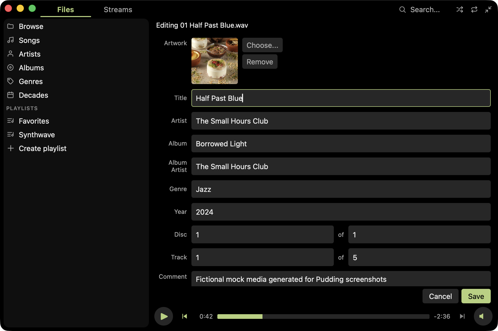

## More cool features

* Drag and drop files or folders from Finder to play them
* Recent file list in File menu
* macOS integration including Control Center and hardware media keys
* Cloud files are shown in the UI but not fetched unless you play them

## Supported Formats

### Audio Files

* MP3 (`.mp3`)
* WAV (`.wav`)
* FLAC (`.flac`)
* AAC and ALAC (`.aac`, `.m4a`)
* Ogg Vorbis (`.ogg`, `.oga`)
* Opus (`.opus`)
* AIFF (`.aiff`, `.aif`)

DRM-protected files are not supported.

### Playlists

* `.m3u8`
* `.m3u`

### Streams

Pudding supports HTTP and HTTPS Icecast and SHOUTcast streams.

Stream URLs that point to `.pls`, `.m3u`, or `.m3u8` playlists are resolved automatically. 

HLS streams and legacy SHOUTcast v1 servers are not currently supported.

## Keyboard Shortcuts

| Shortcut | Action |
| --- | --- |
| `Space` | Play / pause |
| `⌘←` / `⌘→` | Previous / next track |
| `↑` / `↓` | Move the selection up / down the list |
| `Enter` | Activate selected row |
| `Delete` / `Backspace` | Remove the selected row(s) from the queue or playlist |
| `Esc` | Clear the selection |
| `⌘↑` / `⌘↓` (or `+` / `-`) | Volume up / down (10%) |
| `M` | Mute / unmute |
| `←` / `→` | Seek back / forward 10 seconds (files only) |
| `⌘O` | Open a file or playlist |
| `⌘F` / `Ctrl+F` | Focus search |
| `⌘,` | Open Settings |
| `⌘S` | Save the current queue as a playlist |
| `⌘Z` / `⌘⇧Z` | Undo / redo |
| `⌘T` | Toggle visualizer |
| `⌥⌘E` | Open the equalizer |
| `⌘⇧F` | Toggle Zen Mode |
| `⌃⌘F` | Toggle full screen |
| `⌘⇧M` | Toggle the mini player |
